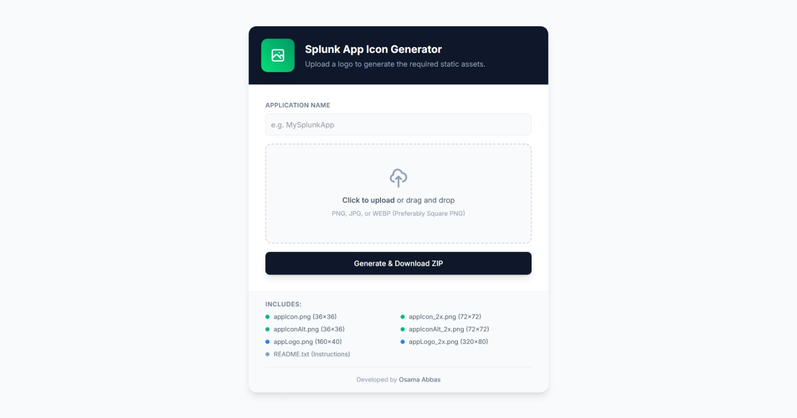

[](https://developer.cisco.com/codeexchange/github/repo/Tes3awy/splunk-icon-generator)
[](https://github.com/psf/black)
[](https://pycqa.github.io/isort/)

# Splunk App Icon Generator

A Flask-based web application that automates the creation of icon assets for Splunk Apps. It takes a single high-resolution source image and generates all the required PNG files with the correct filenames and dimensions specified in the [Splunk Developer Guide](https://dev.splunk.com/enterprise/docs/developapps/createapps/#Add-icons-to-your-app).



## Features

- **One-Click Generation**: Upload one image, get a ZIP file with all required assets.
- **Smart Resizing**:
  - Forces square dimensions for app icons (`36x36`, `72x72`).
  - Preserves aspect ratio for navigation logos (`160x40`, `320x80`).
  - **Splunk Ready**: The downloaded ZIP includes a `README.txt` with specific installation instructions for your Splunk instance.

## Installation

### Prerequisites

- Python 3.10+
- pip

### Local Setup

1. Clone the repository

```bash
$ git clone https://github.com/Tes3awy/splunk-icon-generator.git
$ cd splunk-icon-generator
```

2. Create a virtual environment

```bash
$ python -m venv .venv --upgrade-deps
$ source .venv/bin/activate  # On Windows: .venv\Scripts\activate
```

3. Install dependencies

```bash
$ pip install -r requirements.txt
```

4. Run the application

```bash
$ flask run
```

### Docker Usage

You can also run this application in a container without installing Python locally.

1. Build the image

```bash
docker build -t splunk-icon-gen .
```

2. Run the container

```bash
docker run -p 8080:8080 splunk-icon-gen
```

Open your browser to `http://127.0.0.1:8080`.

## Use Case

This tool is designed for **Splunk App developers and administrators** who need to package their apps with professional-looking icons. Creating the specific image files required by Splunk (different dimensions, aspect ratios, filenames) can be tedious and error-prone. 

**This tool solves that problem strictly:**

1.  **Upload** a single high-resolution image (e.g., `512x512` or larger).
2.  **Generate** a ZIP file containing all mandatory assets:
    -   **App Icons**: `appIcon.png` (`36x36`), `appIcon_2x.png` (`72x72`), and their Alt variants.
    -   **Navigation Logos**: `appLogo.png` (`160x40`), `appLogo_2x.png` (`320x80`).
3.  **Install**: Extract the ZIP directly into your app's `$SPLUNK_HOME/etc/apps/<app_name>/static/` directory.

The tool handles the logic of forcing square dimensions for icons vs preserving aspect ratios for navigation logos, ensuring your app looks polished and meets [Splunkbase certification requirements](https://dev.splunk.com/enterprise/docs/developapps/createapps/#Add-icons-to-your-app).

## License

[MIT](https://choosealicense.com/licenses/mit/)

## Contributing

Contributions are welcome!